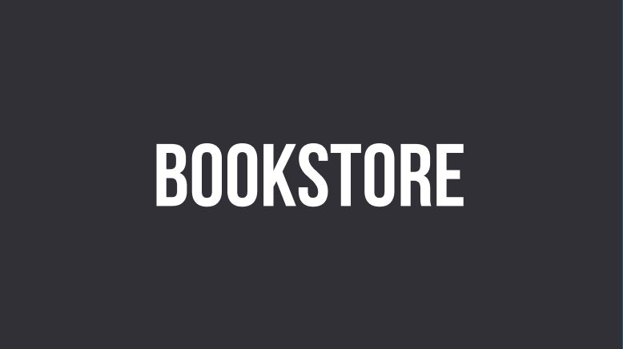
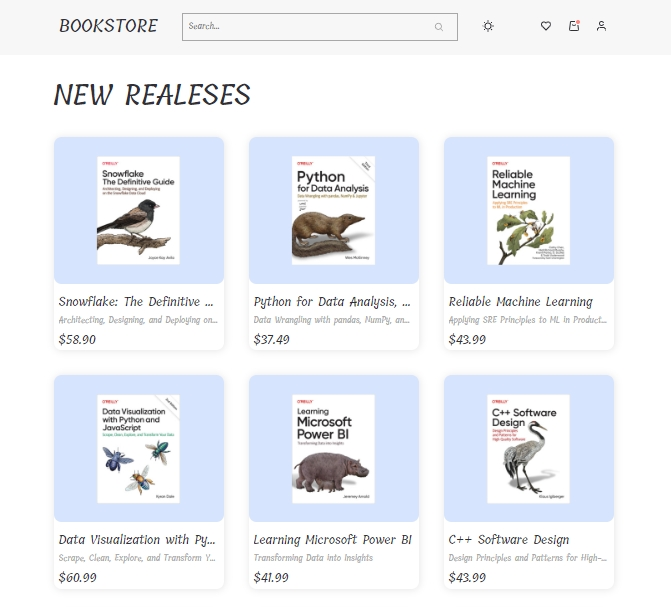
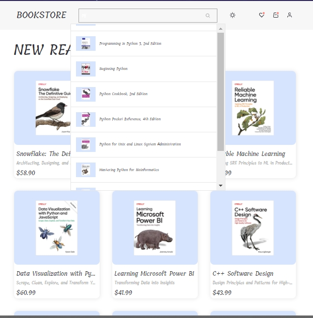
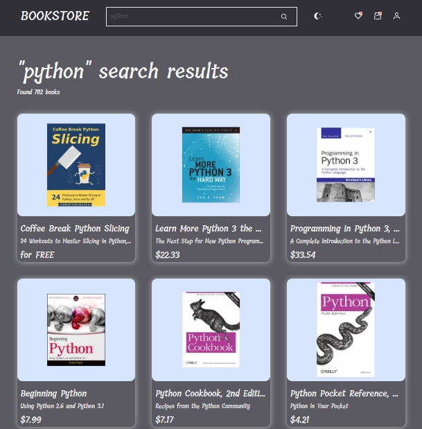
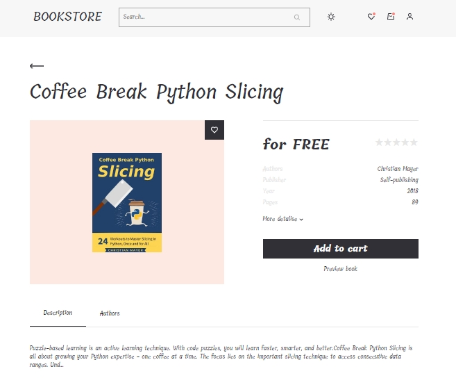
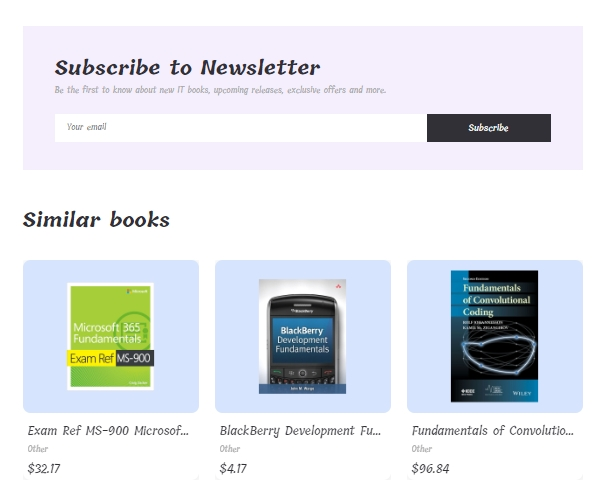
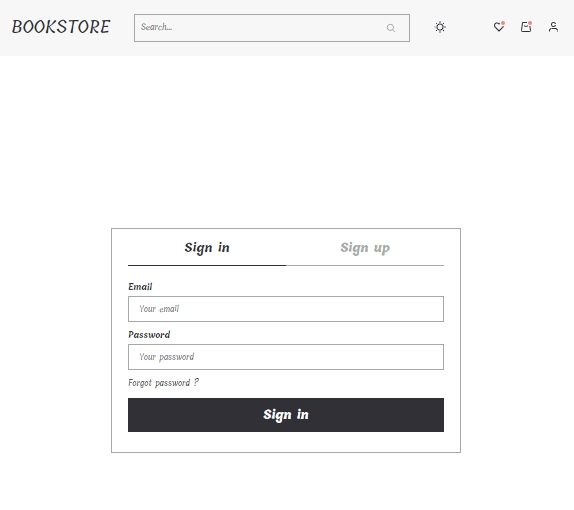
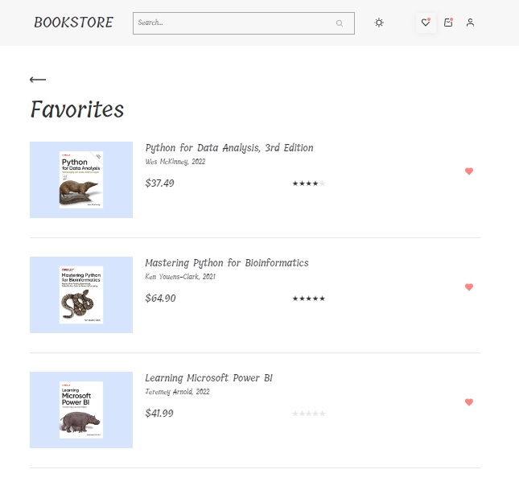
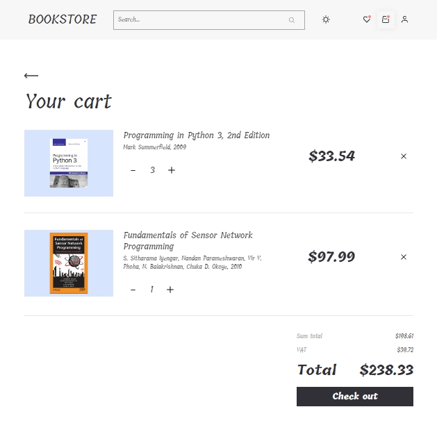
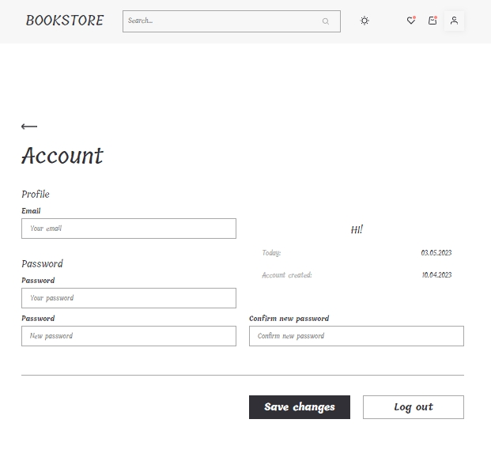

[![Contributors][contributors-shield]][contributors-url]
[![Forks][forks-shield]][forks-url]
[![Stargazers][stars-shield]][stars-url]
[![LinkedIn][linkedin-shield]][linkedin-url]

<a name="readme-top"></a>

<br />
<div align="center">
  <a href="https://michaillyasiuk.github.io/michaill-diplom-bookstore/">
    
  </a>

  <p align="center">
       <br />
    <a href="https://github.com/MichaillYasiuk/michaill-diplom-bookstore.git"><strong>Explore the docs »</strong></a>
    <br />
    <br />
    ·
    <a href="https://michaillyasiuk.github.io/michaill-diplom-bookstore/">See result</a>
    ·

  </p>
</div>

<details>
  <summary>Table of Contents</summary>
  <ol>
    <li>
      <a href="#about-the-project">About The Project</a>
      <ul>
        <li><a href="#built-with">Built With</a></li>
      </ul>
    </li>
    <li>
      <a href="#getting-started">Getting Started</a>
      <ul>
        <li><a href="#prerequisites">Prerequisites</a></li>
        <li><a href="#installation">Installation</a></li>
      </ul>
    </li>
    <li><a href="#usage">Usage</a></li>
    <li><a href="#contact">Contact</a></li>
  </ol>
</details>

## About The Project

A web application, which provides you with possibility to search through a vast books database, providing a several more features alongside which are going to be describeed below.

<p align="right">(<a href="#readme-top">back to top</a>)</p>

### Built With

This section should list any major frameworks/libraries used to bootstrap your project. Leave any add-ons/plugins for the acknowledgements section. Here are a few examples.

- [![React][react.js]][react-url]
- [![Firebase][firebase.google.com]][firebase-url]
- [![Redux Persist][github.com/rt2zz/redux-persist]][persist-url]
- [![react-rating-stars-component][react-rating-stars-component.com]][react-rating-stars-component-url]
- [![keen-slider][keen-slider.com]][keen-slider-url]
- [![react-spinners][react-spinners.com]][react-spinners-url]
- [![styled-components][styled-components]][styled-components-url]
- [![React Router][reactrouter.com]][react-router-url]
- [![React Hook Form][react-hook-form.com]][react-hook-form-url]
- [![React Select][react-select.com]][react-select-url]
- [![Redux Toolkit][redux-toolkit.js.org]][redux-url]
- [![Framer Motion][framer.com]][framer-url]
- [![Axios][axios-http.com]][axios-url]

<p align="right">(<a href="#readme-top">back to top</a>)</p>

## Getting Started

### Prerequisites

This is an example of how to list things you need to use the software and how to install them.

### Installation

2. Clone the repo
   ```sh
   git clone https://github.com/MichaillYasiuk/michaill-diplom-bookstore.git
   ```
3. Install NPM packages
   ```sh
   npm install
   ```
   <p align="right">(<a href="#readme-top">back to top</a>)</p>

<!-- USAGE EXAMPLES -->

## Usage

Go to the homepage of the site and you will see the first 20 books provided by the open database (IT Bookstore API (version 1.0)).



On the Home page you can use a quick search.



Upon clicking on the loupe you will be navigated to the Search page displaying current books search.



Once you have decided on a book, you will be presented with detailed information about each one. We will also recommend books with similar themes.




In order to get access to more features, you will have to create your own user account. For this proceed to the sign up page through the corresponding link.



Upon registration you'll get access to more features. Such as the ability to form the list of your favourite books or add books to the cart. You can search for books on these pages.




Additionally, application provides you with functionality to configure your user profile by changing your email, password or color mode.



All other features of the site you can find out by testing it.

<p align="right">(<a href="#readme-top">back to top</a>)</p>

## Contact

Michail Yasiuk - [@Michail Yasiuk](telegram) - [https://www.linkedin.com/in/michail-yasiuk-42ab79261/](linkedin)

Project Link: [https://github.com/MichaillYasiuk/michaill-diplom-bookstore.git](https://github.com/MichaillYasiuk/michaill-diplom-bookstore.git)

<p align="right">(<a href="#readme-top">back to top</a>)</p>
